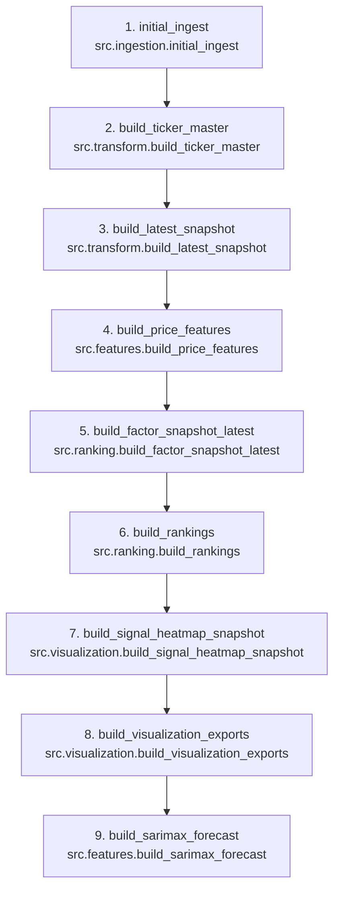

# Finlify Pipeline DAG

This diagram shows the execution order managed by `scripts/run_pipeline.py`. It focuses on orchestration flow only, not the full system architecture.

| Step | Name | Purpose | Primary Output |
|---|---|---|---|
| 1 | initial_ingest | Ingest local Stooq TXT files into the raw parquet layer | `stock_prices.parquet` |
| 2 | build_ticker_master | Build per-ticker metadata from raw prices | `ticker_master.parquet` |
| 3 | build_latest_snapshot | Build the latest per-ticker snapshot dataset | `latest_snapshot.parquet` |
| 4 | build_price_features | Compute feature-engineered price mart for the Finlify universe | `factor_features.parquet` |
| 5 | build_factor_snapshot_latest | Keep the latest feature row per source ticker | `factor_snapshot_latest.parquet` |
| 6 | build_rankings | Compute ranking scores, decisions, and signal metadata | `top_ranked_assets.parquet` / `top_ranked_assets.csv` |
| 7 | build_signal_heatmap_snapshot | Export lightweight signal snapshot for dashboards and heatmaps | `signal_heatmap_snapshot.csv` |
| 8 | build_visualization_exports | Export chart and ranking CSVs for downstream UI/BI use | `price_history_for_pbi.csv` / `latest_ranking_for_pbi.csv` |
| 9 | build_sarimax_forecast | Export forecast CSV for asset detail views | `asset_forecast_for_streamlit.csv` |

## Notes

- The pipeline is orchestrated by `scripts/run_pipeline.py`.
- Each node represents a runnable Python module.
- This DAG shows execution order only.
- Data lineage and system relationships are documented separately in `docs/architecture/pipeline_lineage.md`.

## Assumptions

- None beyond the current step order and outputs already present in `scripts/run_pipeline.py` and the current pipeline modules.