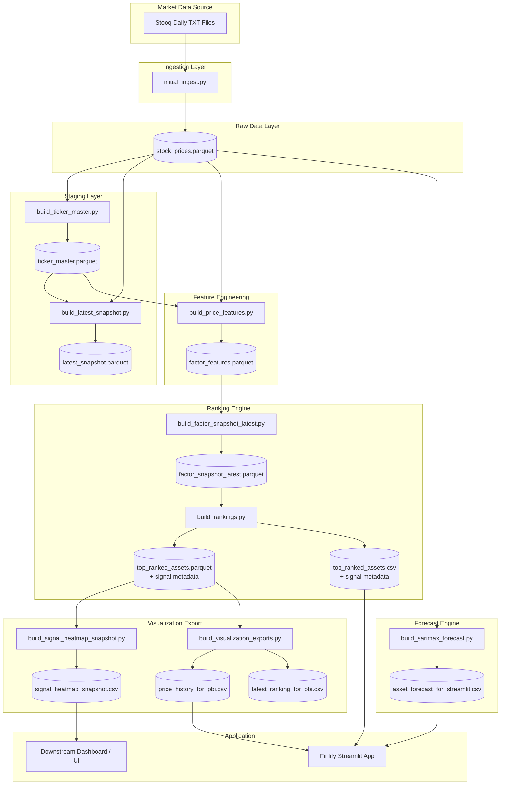

# Finlify System Architecture

```mermaid
flowchart TD

%% -----------------------------
%% Data Source Layer
%% -----------------------------
subgraph DATA_SOURCE["Market Data Source"]
    STOOQ[Stooq Daily TXT Files]
end

%% -----------------------------
%% Ingestion Layer
%% -----------------------------
subgraph INGESTION["Ingestion Layer"]
    INGEST[initial_ingest.py]
end

%% -----------------------------
%% Raw Data Layer
%% -----------------------------
subgraph RAW_LAYER["Raw Data Layer"]
    RAW_PARQUET[(stock_prices.parquet)]
end

%% -----------------------------
%% Staging Layer
%% -----------------------------
subgraph STAGING_LAYER["Staging Layer"]
    BUILD_TICKER[build_ticker_master.py]
    BUILD_SNAPSHOT[build_latest_snapshot.py]

    TICKER[(ticker_master.parquet)]
    SNAPSHOT[(latest_snapshot.parquet)]
end

%% -----------------------------
%% Feature Engineering
%% -----------------------------
subgraph FEATURE_LAYER["Feature Engineering"]
    FEATURES_SCRIPT[build_price_features.py]
    FEATURES[(factor_features.parquet)]
end

%% -----------------------------
%% Ranking Layer
%% -----------------------------
subgraph RANKING_LAYER["Ranking Engine"]
    SNAPSHOT_LATEST_SCRIPT[build_factor_snapshot_latest.py]
    SNAPSHOT_LATEST[(factor_snapshot_latest.parquet)]

    RANK_SCRIPT[build_rankings.py]

    RANK_PARQUET[(top_ranked_assets.parquet<br/>+ signal metadata)]
    RANK_CSV[(top_ranked_assets.csv<br/>+ signal metadata)]
end

%% -----------------------------
%% Forecast Layer
%% -----------------------------
subgraph FORECAST_LAYER["Forecast Engine"]
    FORECAST_SCRIPT[build_sarimax_forecast.py]
    FORECAST_CSV[(asset_forecast_for_streamlit.csv)]
end

%% -----------------------------
%% Visualization Layer
%% -----------------------------
subgraph VIS_LAYER["Visualization Export"]
    HEATMAP_SCRIPT[build_signal_heatmap_snapshot.py]
    VIS_SCRIPT[build_visualization_exports.py]

    HEATMAP_EXPORT[(signal_heatmap_snapshot.csv)]
    PRICE_HISTORY[(price_history_for_pbi.csv)]
    RANKING_EXPORT[(latest_ranking_for_pbi.csv)]
end

%% -----------------------------
%% Application Layer
%% -----------------------------
subgraph APP_LAYER["Application"]
    STREAMLIT[Finlify Streamlit App]
    DASHBOARD[Downstream Dashboard / UI]
end

%% -----------------------------
%% Pipeline Flow
%% -----------------------------
STOOQ --> INGEST
INGEST --> RAW_PARQUET

RAW_PARQUET --> BUILD_TICKER
RAW_PARQUET --> BUILD_SNAPSHOT

BUILD_TICKER --> TICKER
TICKER --> BUILD_SNAPSHOT
BUILD_SNAPSHOT --> SNAPSHOT

RAW_PARQUET --> FEATURES_SCRIPT
TICKER --> FEATURES_SCRIPT
FEATURES_SCRIPT --> FEATURES

FEATURES --> SNAPSHOT_LATEST_SCRIPT
SNAPSHOT_LATEST_SCRIPT --> SNAPSHOT_LATEST

SNAPSHOT_LATEST --> RANK_SCRIPT
RANK_SCRIPT --> RANK_PARQUET
RANK_SCRIPT --> RANK_CSV

RANK_PARQUET --> HEATMAP_SCRIPT
HEATMAP_SCRIPT --> HEATMAP_EXPORT

RANK_PARQUET --> VIS_SCRIPT
VIS_SCRIPT --> PRICE_HISTORY
VIS_SCRIPT --> RANKING_EXPORT

RAW_PARQUET --> FORECAST_SCRIPT
FORECAST_SCRIPT --> FORECAST_CSV

RANK_CSV --> STREAMLIT
FORECAST_CSV --> STREAMLIT
PRICE_HISTORY --> STREAMLIT
HEATMAP_EXPORT --> DASHBOARD
```
